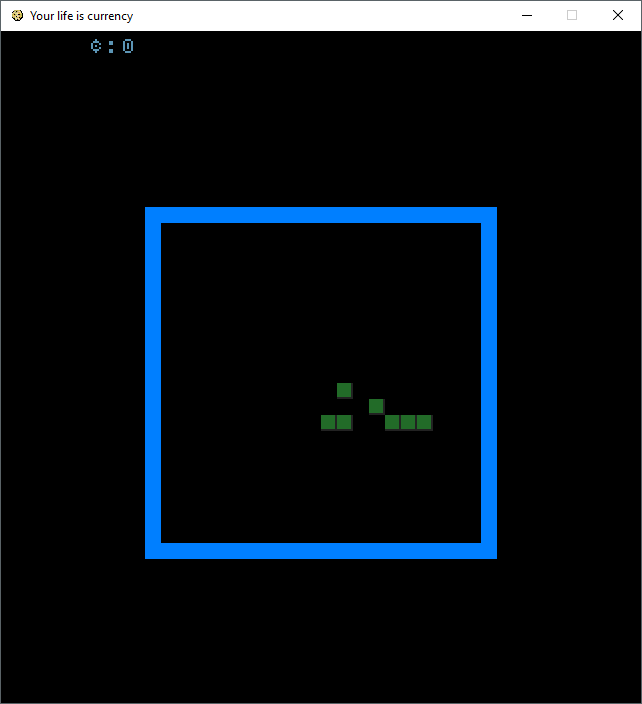
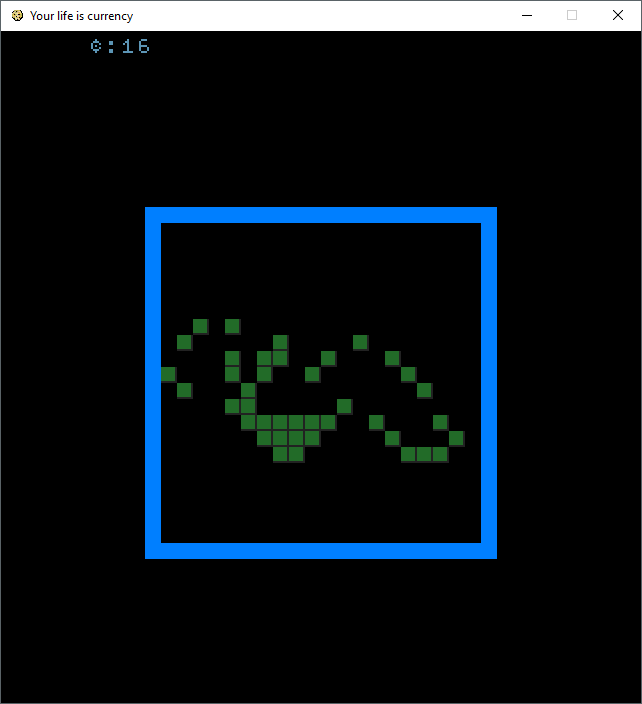
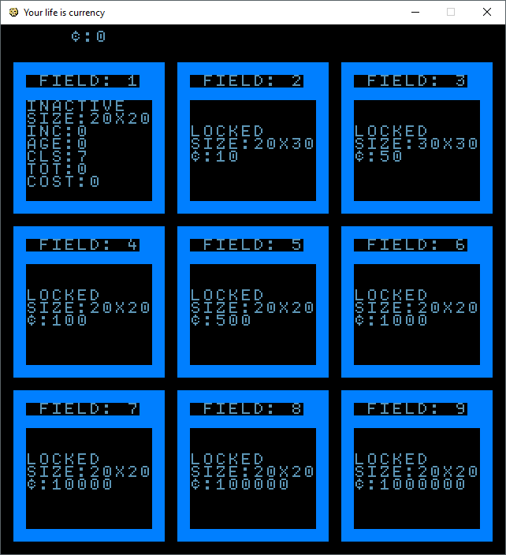
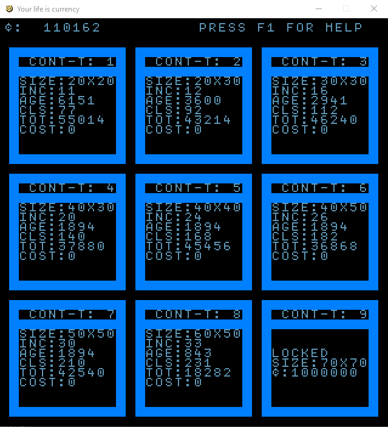
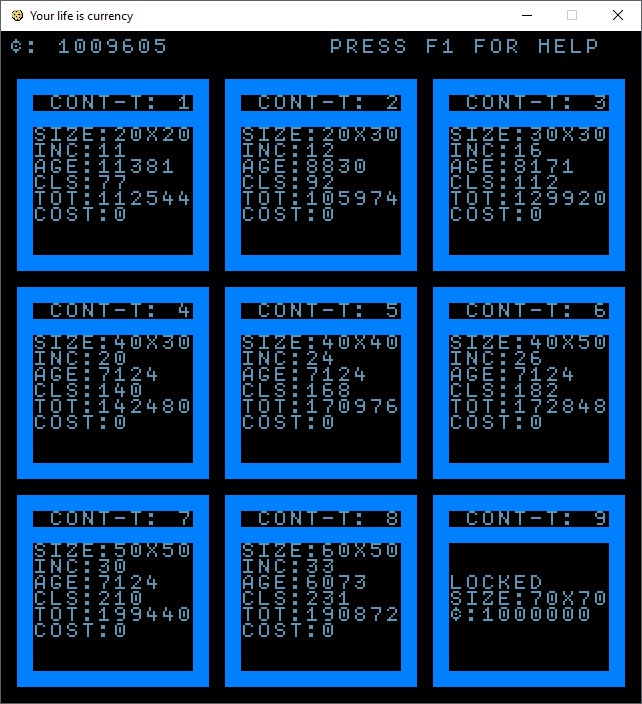

# Your life is currency 

## Ideation

1. Game of Life FARM - by plots & seeds, plant seed, harvest result, rinse repeat
2. Attention == life == money, grinding for in game money you spend your life
3. Consume the weaker. Sacrifice parts of yourself to survive the stronger.
 
##  GOLF (Game of life - farm)

The game is about turning a barren and hostile planet to life. 

The goal of the game is to survive and turn the planet to new Eden Garden.

But this requires a sacrifice. Resources are scarce. Player must bread the 
engineered CONWA-Y, which is used to sustain the player and allow the growth 
and further terraforming.

CONWA-Y - Cyber-Organic Nutrient Woese Archaea - Y 

Conway's GoL is the base mechanics. The player starts with a continents of 20x20, and few cells.
Player should sow the cells on the field and allow it to grow. 

### Victory:
To win the game all continents must be terraformed (unlocked)

### Defeat:
Game over when no cells are left. To delay it player may harvest existing continents

### Drain:
Each cycle costs something - e.g.
* 1-1000: 100 turns cost 1
* 1001-10000: 100 costs 2
* 10001-100000: 100 costs 4
* 100001-1000000: 100 costs 8

### Sowing:
* Player must have a continents
* Player defines where to put alive cells
* Cost of cells grows (i^2/2)

### Growing:
* After sowing is done growth begins on basic Conveys GOL rules 
* Player can stop the growth (costs?) 
* Player can harvest living cells
* If cell is created outside of the borders it becomes an income
* Continents ages (the older the more it costs?)

 
### Terraforming continents:
* Player can terraform (buy) new continents
* Player can run many continents at same time (and it is beneficial)

## Tutorial:

The game goes through following stages:

1. Start a new game
2. Grow and harvest your first continent
3. Explore for pattens giving best yield
4. Plant best patterns and expand to new continents
5. Run out of life cells and die or terraform all continents to win

### Hints:
* To select your continent use matching numbers
* To enter the continent use enter or repeat the number
* You can switch between continents using numbers when you are viewing one
* Use pause (Space) to observe the growth
* Harvesting (H) may be profitable at some points before the continent is exhausted
* Empty continent can be sown (S)
* In sowing screen place use arrows and enter to plan the layout
* Use (S) to plant
* Use (Esc) to abort the sowing and go back to menu 
* Make some money to have a room for improvisation (this is grindy)
* Setup the best layouts and run the game

### Mechanics:
* Each cell growing outside of the continent is auto harvested as a cell
* For each 3 cells on the continent one can be harvested
* The cost of sowing is cells ^ 2 / 2
* Maintenance is collected each 100 turns and is magnitude of age of first field - 2
    0...1000 - 1
    1001...10000 - 2 
    10001...100000 - 3, etc 

